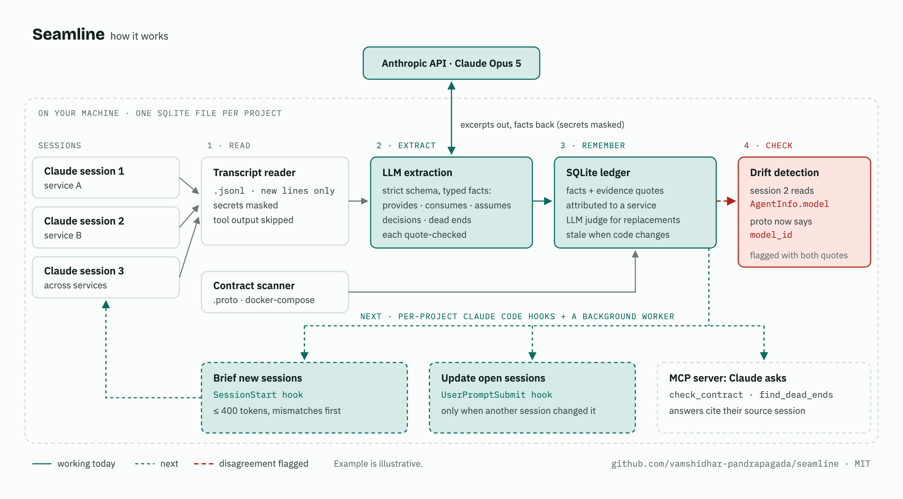

# Seamline

Shared memory across the Claude Code sessions of one project, focused on how the project's
services fit together: which service provides which interface, who consumes it, what each
side assumes about it, plus the decisions made and the dead ends hit along the way. Its
standout feature is **contract drift detection**: flagging when two services' sessions (or a
session and the code) disagree about the same interface.

> **Status: Phases 0–5 done.** Seamline reads your Claude Code sessions, extracts facts
> into a per-project ledger, scans `.proto` and docker-compose contracts, and detects drift.
> Per-project hooks capture sessions in the background (within a daily spending cap), brief
> new sessions, and tell open sessions when another one changed something relevant. An MCP
> server lets Claude query the ledger itself (see [MCP tools](#mcp-tools)).

## How it works



Solid parts work today; dashed parts are next. Everything runs on your machine except
extraction, which sends session excerpts (secrets masked) to the Anthropic API.

```
Claude Code transcripts (~/.claude/projects/…)          proto / docker-compose files
        │                                                          │
        ▼                                                          ▼
 read new lines → mask secrets → keep only your prompts       seamline scan
 and Claude's replies (tool output is never sent)                  │
        │                                                          │
        ▼                                                          │
 Claude extracts typed facts, each with a verbatim quote           │
 (quotes not found in the transcript are discarded)                │
        │                                                          │
        ▼                                                          ▼
 attribute each fact to a service → store in .seamline/ledger.db (SQLite)
        │
        ▼
 duplicates become evidence · newer facts replace older ones · facts the code no longer
 backs go stale · drift: consumer assumptions vs provider facts (sessions and code)
```

Fact kinds: `provides`, `consumes`, `assumes` (a specific claim about someone else's
interface), `decision`, `dead_end` (something tried that failed). Interface kinds: `grpc`,
`http`, `event`, `topic`, `table`, `env`, `config`, `cli`.

## Requirements

- macOS or Linux, Python 3.12, [uv](https://docs.astral.sh/uv/)
- Claude Code (desktop app or CLI): Seamline reads the transcripts it already saves
- An Anthropic API key for extraction (from console.anthropic.com), in
  `SEAMLINE_ANTHROPIC_API_KEY` (read first, and only by Seamline) or `ANTHROPIC_API_KEY`.
  Seamline never stores it. A Claude subscription login is not used. For automatic mode,
  see [Giving the worker a key](#giving-the-worker-a-key).

## Install

```bash
git clone https://github.com/vamshidhar-pandrapagada/seamline-ai.git
uv tool install --editable ./seamline-ai   # puts `seamline` on your PATH
seamline --version
```

`--editable` runs the code straight from the clone, so pulling changes needs no reinstall
(reinstall only when dependencies change). Remove with `uv tool uninstall seamline`.
Nothing is added to `~/.claude/settings.json` or to any other project.

## Set up a project

Run once, at the project root (the folder that contains all its services):

```bash
cd ~/code/my-project
seamline init          # interactive; --yes accepts everything detected
```

`init`:

- **Detects services**: folders one or two levels down containing `package.json`,
  `pyproject.toml`, `Cargo.toml`, `go.mod`, `pom.xml` or a `Dockerfile` (skipping
  `node_modules`, `.venv`, `target`, `dist`, `build`, …). A shared prefix is dropped from
  suggested names (`agent-core` → `core`). Press Enter to keep a name, type a new one, or
  `-` to drop it.
- **Detects contracts**: folders with `.proto` files, `docker-compose*.yml` /
  `compose*.yml`, and OpenAPI files (listed, but not scanned yet).
- **Writes** `seamline.toml` (commit it if you like) and `.seamline/` (the ledger and logs),
  and adds `.seamline/` to `.gitignore` if the folder is a git repo.
- **Installs hooks** and registers the **MCP server** for this project only (see
  [Automatic mode](#automatic-mode-hooks) and [MCP tools](#mcp-tools)), unless you pass
  `--no-hooks`.
- **Warns** if Claude Code's `cleanupPeriodDays` is unset or low (transcripts are deleted
  after ~30 days by default; 365 is a good value) and reports how many sessions it found.

Folders without a build file (e.g. a `skills/` folder of Markdown) aren't proposed. Anything
not listed belongs to the **integration** scope; add a service by hand any time:

```toml
[services]
skills = "skills"
```

Run `init` only once per project, at the root; it refuses to create a project nested
inside another. Only projects you `init` are ever read.

### Where to open sessions

Either way works:

- **In a service folder** (`my-project/payments`): the session's facts default to that
  service.
- **At the project root**, telling Claude which part to work on: facts are attributed one
  by one (see [Attribution](#attribution)). `seamline sessions` lists such sessions as
  `integration`; their facts still land on the right services.

## Everyday use

From anywhere inside the project:

```bash
seamline scan      # read the [contracts] files into facts from code (run again after they change)
seamline ingest    # extract facts from sessions with new lines; shows sessions, model calls
                   # and estimated cost, and asks before calling the model
seamline facts     # what the ledger knows, grouped by kind, with the quote each came from
seamline drift     # open contract mismatches, with a quote from each side
```

Real `drift` output from the `examples/shop` demo (extracted with prompt v3, which still
let the model name the field `field_amount`; v6 asks for the literal field name, and
matching ignores the stray prefix either way):

```
OPEN MISMATCHES (1)
  ✗ `order.created` `field_amount`: payments assumes field_amount (numeric, dollars not cents),
    but orders doesn't provide it (it has `amount_cents`)
      provides orders    c7c9bdc4 L35: "order.created event contract guarantees three fields: …"
      assumes  payments  077c8737 L4: "payload gives us order_id and amount, where amount is the order total …"
```

`drift` exits with status 1 while mismatches are open (0 when clean), so scripts and CI can
react.

## Automatic mode (hooks)

`init` (or `seamline resume` in a project set up before hooks existed) adds Seamline's hooks
to `.claude/settings.local.json` in the project root **and in each service folder**, because
Claude Code only applies a folder's project settings to sessions started in exactly that
folder. Other entries in those files are kept, the files are added to `.gitignore`, and
nothing is written to `~/.claude` or to any other project. Sessions started in an unlisted
subfolder get no hooks; `seamline ingest` still picks them up.

What happens in each session:

| When | What Seamline does | Cost |
|---|---|---|
| Session starts | Adds a **brief** to Claude's context (≤ 400 tokens): open mismatches first, then dead ends, decisions, and what other services say about the interfaces this one uses | ~50 ms, no model call |
| You send a prompt | If another session changed something relevant since, adds a short **update** (≤ 100 tokens), once. Other sessions with unread lines are flagged urgent (catch-up on switch) | ~50 ms, no model call |
| Claude finishes a turn | Flags the session as having new lines | ~50 ms |
| Before compaction, at session end | Flags it urgent | ~50 ms |

A **background worker** (one per project, started by the hooks, exits when idle) ingests a
flagged session once its transcript has been quiet for `idle_minutes` (10), or right away if
it's urgent. So a contract change in one session reaches another session on that session's
next prompt after the change is ingested. Only sessions seen by the hooks are ingested in
the background; older sessions are never backfilled unless you run `seamline ingest`.

**Daily spending cap:** every model call's actual cost is recorded, and the worker stops for
the day before a call that would pass `[worker] daily_budget_usd` ($5 by default). Unread
lines wait for the next day (or for a manual `ingest`). The cap needs a known price for the
model, so a model missing from `extract/pricing.py` is refused.

Hooks follow three rules: they never fail the session (always exit 0), print nothing but
the brief or update, and never call the model. Each call is logged to
`.seamline/logs/hooks.log`; the worker logs to `.seamline/logs/worker.log`.

```bash
seamline status    # hooks per folder, recent hook calls, worker state, flagged sessions, spend
seamline brief --service payments   # exactly what a new payments session would be told
seamline pause     # remove the hooks (config and ledger kept); `seamline resume` re-adds them
seamline remove    # remove hooks and seamline.toml; asks before deleting .seamline/
```

### Giving the worker a key

The hooks, and so the worker, run in the **Claude app's** environment, not your terminal's.
Don't give the app `ANTHROPIC_API_KEY`: Claude Code reads that variable too and may bill
your chats to the key instead of your subscription. Give it a variable only Seamline reads:

```bash
launchctl setenv SEAMLINE_ANTHROPIC_API_KEY sk-ant-...   # macOS; then quit and reopen Claude
```

`launchctl setenv` lasts until you reboot. `seamline status` shows which variable the
worker used last (never the key), or that it found none. A dedicated key with a spend
limit in the Anthropic Console is a good second safeguard next to the daily cap.

`resume` also picks up services added to `seamline.toml` since, and removes hooks from
folders that are no longer services. Open sessions keep the hooks they started with until
they restart; while paused, those hooks do nothing.

## MCP tools

`init` (or `seamline resume`) also adds a `seamline` server to the project's `.mcp.json`.
Claude Code finds that file from any folder inside the project, so one entry at the root
serves every service. It asks you to approve the server the first time; Seamline doesn't
approve itself. If Seamline created the file, it's added to `.gitignore` (it holds this
machine's paths).

**Approving it:** the desktop app may not ask. Run `claude` once in the project folder in a
terminal and approve **seamline** (or use `/mcp` there); that writes
`"enabledMcpjsonServers": ["seamline"]` into that folder's `.claude/settings.local.json`.
Approval is per folder, so do it in each service folder you start sessions in. Sessions
already open (or resumed) keep the servers they started with; start a new one.

| Tool | Claude calls it to… |
|---|---|
| `get_integration_context(services)` | see how services fit together: every shared interface, each side's claims with sources, open mismatches first |
| `check_contract(interface)` | see every claim about one event, endpoint or message (any spelling: `order.created`, `OrderCreated`), with quotes, dates and history |
| `find_dead_ends(topic)` | check whether an approach was already tried and abandoned, and why |
| `search_history(query)` | find decisions, current and superseded, with their sources |
| `remember(fact, kind?, service?, interface?)` | store something **you** stated or confirmed, so other sessions see it |

All but `remember` are read-only. Answers are Markdown under a size cap; every fact line
cites its session and line (or file), and each answer ends with how fresh it is.

**Catch-up on demand:** before answering, `get_integration_context` and `check_contract`
have other sessions' unread lines extracted first (by the background worker, so the daily
cap applies), waiting up to 30 s. If that isn't enough, the answer says which session is
still being read. The server logs where it started to `.seamline/logs/mcp.log`.

## Commands

| Command | What it does | Options |
|---|---|---|
| `seamline init [PATH]` | Set up a project (above) | `-y/--yes` accept all; `--force` overwrite `seamline.toml`; `--no-hooks` |
| `seamline sessions` | The project's sessions by service, size, activity, and how much is ingested | `--root DIR` (works on folders without `init`) |
| `seamline show <session>` | A session's events labeled `keep` / `anchor` / `evidence` / `skip` (a unique id prefix is enough) | `--all` include skipped; `--full` untruncated; `--root` |
| `seamline extract <session>` | **Dry run**: extract and print facts, store nothing | `--model`, `--max-chunks N`, `--json FILE` (save the result, e.g. for `eval/`), `--debug` (raw model reply), `--root` |
| `seamline ingest [session]` | Extract new session lines into the ledger | `-y/--yes` skip the cost prompt; `--redo` re-extract that session from the start with the current prompt and rules; `--max-chunks N`; `--model`; `--root` |
| `seamline facts` | List facts with sources (session facts; code facts hidden) | `--service X`, `--kind K`, `--code` (only facts from code), `--all` (include superseded/stale, with the reason) |
| `seamline scan` | Read `[contracts]` into facts from code | `--root` |
| `seamline drift` | Check facts against the code, recompute and list mismatches | `--root` |
| `seamline status` | Hooks, recent hook calls, worker state, flagged sessions, today's spend | `--root` |
| `seamline brief` | Print the brief a new session would get | `--service X` (default: project root); `--root` |
| `seamline pause` / `resume` | Turn recording off / on for this project (hooks removed / re-added) | `--root` |
| `seamline remove` | Remove hooks and `seamline.toml`; asks before deleting `.seamline/` | `--root` |
| `seamline worker` | Run the background worker in the foreground (normally the hooks start it) | `--root` |
| `seamline hook <Event>` | What the hooks call (JSON from Claude Code on stdin) | |
| `seamline mcp` | Run the MCP server over stdio (Claude Code starts it from `.mcp.json`) | `--root` |

Commands that read or write the ledger need a project that has run `init`; they never
create `.seamline/` elsewhere.

## Configuration: `seamline.toml`

```toml
project = "agent-platform"

[services]                        # name = folder, relative to this file
core = "agent-core"             # the longest matching folder wins; unlisted folders and
orchestrator = "agent-orchestrator"  # the root are the "integration" scope

[contracts]                       # files or folders scanned by `seamline scan`
paths = ["proto", "docker/docker-compose.yml"]

[extract]
provider = "anthropic"            # the only provider
model = "claude-opus-5"           # default; claude-haiku-4-5 is cheaper but less precise

[worker]
idle_minutes = 10                 # the worker ingests a session after this long without new lines
daily_budget_usd = 5.0            # background extraction stops for the day at this spend

[brief]
max_tokens = 400                  # brief at session start
update_max_tokens = 100           # update on a later prompt
```

Unknown keys are errors, so typos don't pass silently. Service names use lowercase letters,
digits, `-` and `_`; `integration` is reserved.

## How facts stay accurate

**Extraction.** Sessions are split into turn-aligned excerpts (~6k tokens). Only your
prompts and Claude's replies are sent; files Claude touched appear as context lines like
`(Claude edited services/orders/events.py)`. The model fills a strict schema through a
forced tool call. Every fact must quote one line of the transcript word for word (only
formatting may differ); otherwise it's discarded. The prompt is versioned
(`src/seamline/extract/prompts/extract_facts.md`, currently v6) and records only what was
said, never the extractor's own judgments.

<a id="attribution"></a>**Attribution** (which service a fact is about), in order:

1. the service the extractor set because the text names it;
2. files the fact's own text mentions that the session touched (`client.py`,
   `agent-core/src/grpc/…`);
3. a service or folder name in the fact's text;
4. files touched around the statement: tool calls since Claude last spoke, then until it
   next speaks, then the whole turn (paths in `Read`/`Edit`/`Write` and in Bash commands);
5. the folder the session started in; otherwise the integration scope.

**Storing.** Interface names are normalized (`order.created` = `OrderCreated` =
`ORDER_CREATED`; `POST /orders/{id}` = `post /orders/:orderId`; a proto message and its
package-qualified name are one interface). A repeated fact becomes extra evidence on the
existing one. A newer statement on the same subject replaces the older one: rules decide
clear cases (a full restatement); ambiguous pairs (renames like `amount` → `total_cents`,
look-alike fields like `created_at` / `updated_at`, similar decisions) go to a small LLM
judge that answers "does the newer fact replace the older one?", keeping both when unsure.
Facts from sessions and facts from code never replace each other.

**Staleness.** A session fact is marked stale when its service's code changed *after* the
statement and a field it names is no longer used in that code (as a quoted key, attribute or
declaration, in snake/camel/Pascal case). It's restored if the field comes back. Unchanged
code isn't evidence: the contract may simply not be written yet.

**Drift.** Each active `assumes` fact is compared with the `provides` facts for the same
interface from other services and from code (code is ground truth). Flagged: a typed field
the consumer assumes that the provider doesn't have (with a hint: "it has `amount_cents`"),
and the same field with conflicting types. Only details that name a type take part, so
free-form notes never raise alarms. Mismatches resolve by themselves when either side is
fixed or goes stale.

**Resumed sessions.** Resuming a session copies its history into a new transcript; copied
records are recognized and extracted only once.

## Privacy and cost

- **What leaves your machine:** excerpts of your prompts and Claude's replies (after
  masking API keys, tokens, passwords, private keys, URL credentials, and `NAME=value`
  secrets; the content of `.env` files Claude read is masked entirely), sent to the
  Anthropic API with your key. Tool output is never sent.
- **What stays local:** the ledger (`.seamline/ledger.db`, git-ignored), logs, and the
  original transcripts (Seamline never modifies them).
- **Cost:** on Claude Opus 5, about 4–5 cents per excerpt (measured); a typical session is
  1–3 excerpts. The judge's calls are rare and small. `ingest` shows an estimate and asks
  before spending; `--yes` skips the question.
- **Spend tracking:** every model call's cost (the token usage the API reports × list
  prices) is recorded in the ledger. `ingest` shows today's total against
  `[worker] daily_budget_usd` ($5 by default). The cap stops background work; runs you
  confirm yourself are recorded but not blocked. For a hard limit on the key
  itself, also set a spend limit in the Anthropic Console.

## Known limitations

- **Claude Code only.** Other IDEs' histories aren't read (the reader sits behind a
  source-adapter interface for later).
- **Contracts:** only `.proto` and docker-compose are scanned; OpenAPI is detected but not
  read. Compose env vars are recorded by name only, never their values.
- **Drift** misses a unit stated only in the value (`integer milliseconds` vs `integer
  seconds`) and raises a false alarm when a consumer flattens a nested field (`customer`
  vs `customer_id`). Both are tracked in `eval/drift_cases.toml`.
- **Attribution:** a `cd` inside a Bash command isn't followed.
- **Staleness** relies on file modification times (a fresh clone or branch switch makes all
  code look newer), makes a whole fact stale when one field is gone, and counts a field
  named in a comment as used.
- **Extraction precision** was measured on a small real sample: 80–93% on two multi-service
  sessions with Opus 5 (vs ~40% with Haiku 4.5). Keep an eye on it; statements of a state
  that the same session then fixed can still slip through as current facts.
- Subagent transcripts are counted but not read.
- **Automatic mode is new:** it passed one live trial in the desktop app (two services, a
  renamed field and a unit mismatch both caught and relayed, ~$0.22 on Opus 5). Hooks take
  10–60 ms; the first one after the app starts can take about a second.
- **Echoes:** when Claude repeats what Seamline told it (a brief, an update, a tool answer)
  in its own words, extraction can record that as the session's own fact. Quotes still
  point at the session, so `check_contract` shows where it came from.
- **Evidence from restatements:** when a session restates another service's contract, the
  newer statement replaces the original fact instead of adding evidence to it, so `drift`
  may quote the restating session rather than the owning one.

## Roadmap

- **Phase 4 (done):** hooks, background worker, briefs and updates, the daily cap (see
  [Automatic mode](#automatic-mode-hooks)).
- **Phase 5 (done):** MCP tools Claude calls for detail (see [MCP tools](#mcp-tools)). In
  the live trial on a real two-service project, a new session loaded them unprompted,
  called `check_contract` before planning, and its plan avoided a dead end recorded by an
  earlier session.
- **Phase 6:** two weeks of real use, a Claude Code plugin if it can be enabled per
  project, and the demo.

## Development

```bash
uv sync
uv run pytest                                     # ~240 tests, no network
uv run ruff check . && uv run ruff format --check .
```

- **Evaluation** (separate from tests; calls the real model):
  [`eval/README.md`](eval/README.md). `eval/score_extraction.py` drafts label files from an
  `extract --json` result and scores precision/recall against your corrected labels;
  `eval/score_drift.py` runs the planted drift cases (currently 22/22, plus 2 known
  limitations reported separately).
- **Demo:** `examples/shop` (orders, payments, notifications) with a planted mismatch:
  orders emits `amount_cents`, payments reads `amount`.
- **Findings from real data:** [`docs/transcript-format.md`](docs/transcript-format.md)
  (how Claude Code stores sessions) and [`docs/hook-behavior.md`](docs/hook-behavior.md)
  (which hooks fire in the desktop app, and why hooks are per project).
- **Hook experiment scripts** (Phase 1): `scripts/probe_hooks.sh install --project DIR |
  uninstall | report`, which log hook calls without recording any conversation content.

## License

[MIT](LICENSE)
